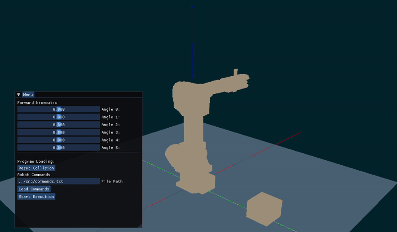

# Virtual Laboratory of Industrial Robots

This project is my first try to write a virtual simulation environment for controlling and visualizing the behavior of industrial robotic arms. It provides tools for forward and inverse kinematics, command execution, and real-time rendering using OpenGL and ImGui.

## Features

- **Robot Arm Simulation**: Simulate the movement of a robotic arm with multiple joints and links.
- **Forward and Inverse Kinematics**: Calculate and visualize the robot's position and orientation.
- **Command Execution**: Load and execute predefined commands for the robot arm.
- **Real-Time Rendering**: Visualize the robot arm and its environment using OpenGL.
- **User Interface**: Interact with the simulation through an ImGui-based GUI.

## Project Structure

```
.
├── include/               # Header files
│   ├── imgui/             # ImGui library
│   ├── assimp/            # Assimp library for 3D model loading
│   ├── stb/               # stb_image for texture loading
│   ├── roboArm.h          # Robot arm implementation
│   ├── command.h          # Command handling
│   └── ...                # Other utility headers
├── src/                   # Source files
│   ├── imgui/             # ImGui backend implementations
│   ├── main.cpp           # Main application entry point
│   ├── imgui_renderer.cpp # ImGui rendering setup
│   └── ...                # Other source files
├── bin/                   # Compiled binaries and libraries
├── models/                # 3D models for the simulation
├── README.md              # Project documentation
```

## Dependencies

- **OpenGL**: For rendering the simulation.
- **GLFW**: For window and input handling.
- **GLM**: For mathematical operations.
- **ImGui**: For the graphical user interface.
- **Assimp**: For loading 3D models.
- **stb_image**: For texture loading.

## Getting Started

### Prerequisites

Ensure you have the following installed:

- A C++ compiler supporting C++17 or later.
- CMake (for building the project).
- OpenGL drivers.

### Building the Project

1. Clone the repository:
   ```bash
   git clone https://github.com/annaivanytska/Virtual-Laboratory-of-Industrial-Robots.git
   cd Virtual-Laboratory-of-Industrial-Robots
   ```

2. Configure and build the project:
   ```bash
   cd build
   make
   ```

3. Run the application:
   ```bash
   ./bin/main.exe
   ```

### Running the Simulation

1. Launch the application.
2. Use the ImGui interface to control the robot arm:
   - Adjust joint angles using sliders.
   - Load and execute commands from a file.
   - Visualize forward and inverse kinematics.



## Command File Format

Commands can be loaded from a file (./src/commands.txt) . The file should contain a list of commands in the following format:

```
GOTO x y z
OPEN
CLOSE
SAVE_HOME
MOVE_A
WAIT t
```

## Acknowledgments

- [Dear ImGui](https://github.com/ocornut/imgui) for the GUI library.
- [Assimp](https://github.com/assimp/assimp) for 3D model loading.
- [stb_image](https://github.com/nothings/stb) for texture loading.
